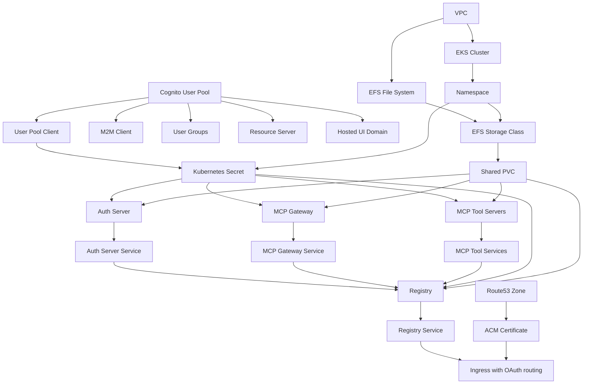
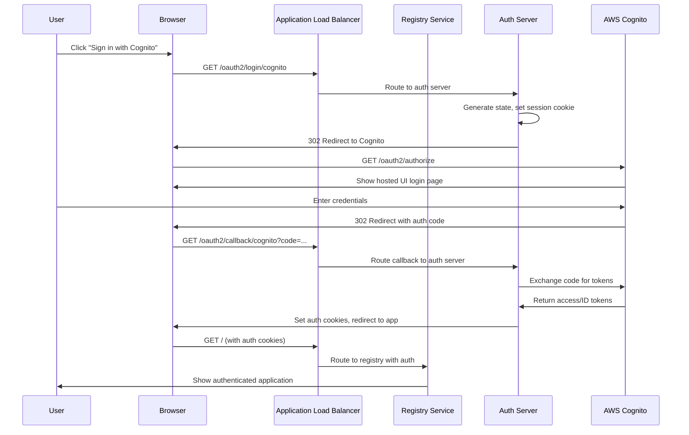

# MCP Gateway Registry CDK Architecture

## Overview

This CDK project converts the MCP Gateway Registry from a monolithic CloudFormation deployment to a modern microservices architecture using AWS CDK and TypeScript. The solution provides significant resource savings, improved operational characteristics, and full OAuth authentication via AWS Cognito.

## Architecture Comparison

### Before (CloudFormation Monolithic)
- **Single Container**: All services in one container
- **Resource Usage**: 8 CPU, 32Gi memory
- **Deployment**: Single CloudFormation template
- **Scaling**: All-or-nothing scaling
- **Authentication**: Basic authentication
- **Maintenance**: Complex, tightly coupled

### After (CDK Microservices)
- **6 Microservices**: Independent, loosely coupled services
- **Resource Usage**: 2.85 CPU, 8.77Gi memory (64-73% reduction)
- **Deployment**: CDK with proper dependencies
- **Scaling**: Per-service scaling
- **Authentication**: OAuth with AWS Cognito hosted UI
- **Maintenance**: Simple, independent updates

## Deployment Modes

### 1. Application-Only Mode (Default)
- **Purpose**: Deploy microservices to existing infrastructure
- **Prerequisites**: Existing EKS cluster, EFS, ACM certificate
- **Deployment Time**: 5-10 minutes
- **Use Case**: Development, testing, existing infrastructure

### 2. Complete Infrastructure Mode
- **Purpose**: Deploy everything from scratch
- **Creates**: VPC, EKS, EFS, Cognito, ACM certificate, Route53 records
- **Deployment Time**: 20-30 minutes
- **Use Case**: Production, new environments, enterprise deployment

## CDK Implementation Details

### Stack Structure

#### Application-Only Mode
```typescript
McpgwMicroservicesCdkStack
├── Namespace (mcp-registry)
├── Kubernetes Secret (Cognito credentials)
├── EFS Storage Class
├── Shared PVC
├── Auth Server (Deployment + Service)
├── MCP Gateway (Deployment + Service)
├── Current Time Server (Deployment + Service)
├── Financial Info Server (Deployment + Service)
├── Real Server Fake Tools (Deployment + Service)
├── Registry Service (Deployment + Service)
└── Ingress (external access with OAuth routing)
```

#### Complete Infrastructure Mode
```typescript
McpgwCompleteInfrastructureStack
├── VPC (3 AZs, public/private subnets)
├── EKS Fargate Cluster
├── EFS File System
├── ACM Certificate (with DNS validation)
├── Cognito User Pool
│   ├── User Pool Client (OAuth)
│   ├── M2M Client (Machine-to-Machine)
│   ├── User Groups (admin, user)
│   ├── Resource Server (custom scopes)
│   └── Hosted UI Domain
├── Route53 Records (optional)
├── AWS Load Balancer Controller
├── EFS CSI Driver
└── Application Stack (all microservices)
```

### Key CDK Features Used

1. **EKS Integration**: Uses `cluster.addManifest()` for Kubernetes resources
2. **CDK Nag**: Automatic security validation
3. **Proper Dependencies**: Ensures correct deployment order
4. **Type Safety**: Full TypeScript type checking
5. **Testing**: Comprehensive unit tests
6. **Configuration Management**: Environment variables and context
7. **Cognito Integration**: Full OAuth flow with hosted UI
8. **Multi-Mode Deployment**: Application-only vs complete infrastructure

### Resource Dependencies



## OAuth Authentication Architecture

### Cognito Configuration
```typescript
// User Pool with security settings
const userPool = new cognito.UserPool(this, 'McpUserPool', {
  userPoolName: `mcp-gateway-users-${props.clusterName}`,
  selfSignUpEnabled: true,
  signInAliases: { email: true, username: true },
  passwordPolicy: {
    minLength: 12,
    requireLowercase: true,
    requireUppercase: true,
    requireDigits: true,
    requireSymbols: true,
  },
  accountRecovery: cognito.AccountRecovery.EMAIL_ONLY,
});

// OAuth Client with proper scopes
const userPoolClient = new cognito.UserPoolClient(this, 'McpUserPoolClient', {
  userPool,
  generateSecret: true,
  authFlows: { userPassword: true, userSrp: true },
  oAuth: {
    flows: { authorizationCodeGrant: true },
    scopes: [
      cognito.OAuthScope.EMAIL,
      cognito.OAuthScope.OPENID,
      cognito.OAuthScope.PROFILE,
      cognito.OAuthScope.custom('aws.cognito.signin.user.admin'),
    ],
    callbackUrls: [
      `http://localhost:9090/callback`,
      `http://localhost/oauth2/callback/cognito`,
      `http://localhost:8888/oauth2/callback/cognito`,
      `https://${props.domainName}/oauth2/callback/cognito`,
    ],
  },
});
```

### OAuth Flow Architecture


### User Management
```typescript
// Admin and User Groups
const adminGroup = new cognito.CfnUserPoolGroup(this, 'McpAdminGroup', {
  userPoolId: userPool.userPoolId,
  groupName: 'mcp-registry-admin',
  description: 'Admin group for MCP Registry users',
});

const userGroup = new cognito.CfnUserPoolGroup(this, 'McpUserGroup', {
  userPoolId: userPool.userPoolId,
  groupName: 'mcp-registry-user',
  description: 'Regular user group for MCP Registry',
});

// Default admin user
const adminUser = new cognito.CfnUserPoolUser(this, 'McpAdminUser', {
  userPoolId: userPool.userPoolId,
  username: 'admin',
  messageAction: 'SUPPRESS',
  userAttributes: [
    { name: 'email', value: 'admin@example.com' },
    { name: 'email_verified', value: 'true' },
  ],
});
```

### Machine-to-Machine Authentication
```typescript
// Resource Server for M2M
const resourceServer = new cognito.UserPoolResourceServer(this, 'McpResourceServer', {
  userPool,
  identifier: 'mcp-servers-unrestricted',
  userPoolResourceServerName: 'MCP Servers Unrestricted',
  scopes: [
    new cognito.ResourceServerScope({
      scopeName: 'read',
      scopeDescription: 'Read access to all MCP servers',
    }),
    new cognito.ResourceServerScope({
      scopeName: 'execute',
      scopeDescription: 'Execute access to all MCP servers',
    }),
  ],
});

// M2M Client for agents
const m2mClient = new cognito.UserPoolClient(this, 'McpM2MClient', {
  userPool,
  userPoolClientName: 'mcp-agent-client',
  generateSecret: true,
  authFlows: { userSrp: false, userPassword: false },
  oAuth: {
    flows: { clientCredentials: true },
    scopes: [
      cognito.OAuthScope.resourceServer(resourceServer, readScope),
      cognito.OAuthScope.resourceServer(resourceServer, executeScope),
    ],
  },
});
```

## Microservices Architecture

### 1. Auth Server (auth-server:8888)
- **Purpose**: OAuth authentication, Cognito integration, session management
- **Resources**: 250m CPU, 512Mi memory
- **Dependencies**: Cognito User Pool, Kubernetes Secret
- **Health Check**: HTTP /health endpoint
- **OAuth Endpoints**:
  - `/oauth2/providers` - List available OAuth providers
  - `/oauth2/login/cognito` - Initiate Cognito OAuth flow
  - `/oauth2/callback/cognito` - Handle OAuth callback
- **Environment Variables**:
  ```typescript
  COGNITO_CLIENT_ID: userPoolClient.userPoolClientId
  COGNITO_CLIENT_SECRET: userPoolClient.userPoolClientSecret
  COGNITO_USER_POOL_ID: userPool.userPoolId
  COGNITO_DOMAIN: userPoolDomain.domainName
  AUTH_SERVER_EXTERNAL_URL: `https://${props.domainName}`
  ```

### 2. Registry Service (registry:7860)
- **Purpose**: Main UI, nginx proxy, ML models, OAuth integration
- **Resources**: 1 CPU, 4Gi memory
- **Dependencies**: Auth Server, EFS, Cognito credentials
- **Health Check**: HTTP /health endpoint
- **OAuth Integration**: Validates authentication tokens
- **Startup Time**: 15-20 minutes (ML model download)

### 3. MCP Gateway (mcpgw-server:8003)
- **Purpose**: MCP protocol gateway with authentication
- **Resources**: 500m CPU, 1Gi memory
- **Dependencies**: Auth Server, Cognito credentials
- **Health Check**: HTTP /health endpoint
- **Authentication**: Validates OAuth tokens for MCP requests

### 4. Current Time Server (currenttime-server:8000)
- **Purpose**: Time utilities and tools
- **Resources**: 250m CPU, 500Mi memory
- **Dependencies**: Basic configuration
- **Health Check**: HTTP /health endpoint

### 5. Financial Info Server (fininfo-server:8001)
- **Purpose**: Financial data and market tools
- **Resources**: 250m CPU, 500Mi memory
- **Dependencies**: API keys via Kubernetes Secret
- **Health Check**: HTTP /health endpoint

### 6. Real Server Fake Tools (realserverfaketools-server:8002)
- **Purpose**: Example MCP tools and testing
- **Resources**: 250m CPU, 500Mi memory
- **Dependencies**: Basic configuration
- **Health Check**: HTTP /health endpoint

## Ingress and Routing

### ALB Ingress Configuration
```typescript
const ingress = {
  apiVersion: 'networking.k8s.io/v1',
  kind: 'Ingress',
  metadata: {
    name: 'mcp-registry-ingress',
    namespace: props.namespace,
    annotations: {
      'kubernetes.io/ingress.class': 'alb',
      'alb.ingress.kubernetes.io/scheme': 'internet-facing',
      'alb.ingress.kubernetes.io/target-type': 'ip',
      'alb.ingress.kubernetes.io/listen-ports': '[{"HTTP": 80}, {"HTTPS": 443}]',
      'alb.ingress.kubernetes.io/ssl-redirect': '443',
      'alb.ingress.kubernetes.io/certificate-arn': props.certificateArn,
    },
  },
  spec: {
    rules: [{
      host: props.domainName,
      http: {
        paths: [
          {
            path: '/oauth2',
            pathType: 'Prefix',
            backend: {
              service: { name: 'auth-server', port: { number: 8888 } }
            }
          },
          {
            path: '/auth',
            pathType: 'Prefix',
            backend: {
              service: { name: 'auth-server', port: { number: 8888 } }
            }
          },
          {
            path: '/',
            pathType: 'Prefix',
            backend: {
              service: { name: 'registry', port: { number: 7860 } }
            }
          }
        ]
      }
    }]
  }
};
```

### Cross-Browser Compatibility
- **Firefox**: Full OAuth support, session management working
- **Chrome**: Full OAuth support with proper cookie handling
- **Safari**: Compatible with standard OAuth flow
- **Edge**: Standard OAuth compatibility

## Configuration Management

### Environment Variables (Application-Only Mode)
```bash
# .env configuration
DEPLOY_COMPLETE_INFRASTRUCTURE=false
CLUSTER_NAME=mcp-gateway-registry
DOMAIN_NAME=mcp.v2n2x.com
EFS_FILE_SYSTEM_ID=fs-037112380c8bf7ede
CERTIFICATE_ARN=arn:aws:acm:region:account:certificate/your-cert-id
ADMIN_PASSWORD=NewTempPassword123!
```

### Environment Variables (Complete Infrastructure Mode)
```bash
# .env configuration
DEPLOY_COMPLETE_INFRASTRUCTURE=true
DOMAIN_NAME=mcp.yourdomain.com
ADMIN_PASSWORD=your-secure-password
AWS_PROFILE=your-aws-profile
AWS_REGION=us-east-1
CREATE_CERTIFICATE=true
HOSTED_ZONE_ID=Z1234567890ABC
```

### CDK Context Configuration
```json
{
  "deployCompleteInfrastructure": true,
  "domainName": "mcp.yourdomain.com",
  "adminPassword": "secure-password",
  "awsRegion": "us-east-1",
  "createCertificate": true,
  "hostedZoneId": "Z1234567890ABC"
}
```

### Kubernetes Secret Management
```typescript
// Cognito credentials stored securely
const secret = {
  apiVersion: 'v1',
  kind: 'Secret',
  metadata: { name: 'mcp-gateway-secrets', namespace: props.namespace },
  type: 'Opaque',
  data: {
    'ADMIN_PASSWORD': Buffer.from(props.adminPassword).toString('base64'),
    'COGNITO_CLIENT_ID': Buffer.from(cognitoClientId).toString('base64'),
    'COGNITO_CLIENT_SECRET': Buffer.from(cognitoClientSecret).toString('base64'),
    'COGNITO_USER_POOL_ID': Buffer.from(cognitoUserPoolId).toString('base64'),
    'COGNITO_DOMAIN': Buffer.from(cognitoDomain).toString('base64'),
  },
};
```

## Security Implementation

### CDK Nag Integration
```typescript
// Apply CDK Nag for security best practices
cdk.Aspects.of(this).add(new AwsSolutionsChecks({ verbose: true }));

// Add suppressions for EKS-specific requirements
NagSuppressions.addStackSuppressions(this, [
  {
    id: 'AwsSolutions-IAM4',
    reason: 'EKS cluster requires managed policies for proper operation'
  },
  {
    id: 'AwsSolutions-COG2',
    reason: 'MFA not required for development environment'
  }
]);
```

### Security Features
- **OAuth 2.0 + OIDC**: Industry-standard authentication
- **AWS Cognito**: Managed identity provider with hosted UI
- **HTTPS Only**: ALB with SSL termination
- **Kubernetes Secrets**: Sensitive data encrypted at rest
- **Network Isolation**: ClusterIP services for internal communication
- **Least Privilege**: Minimal IAM permissions
- **Container Security**: Non-root containers where possible
- **Session Management**: Secure cookie handling with HttpOnly flags

### Production Security Checklist
- ✅ **OAuth Authentication**: Working with Cognito hosted UI
- ✅ **HTTPS Enforcement**: SSL redirect enabled
- ✅ **Secret Management**: Kubernetes secrets for sensitive data
- ✅ **Network Security**: Private subnets for EKS nodes
- ✅ **IAM Roles**: Least privilege access
- ✅ **CDK Nag**: Security best practices validation
- ✅ **User Groups**: Admin and user role separation
- ✅ **Session Security**: HttpOnly cookies, proper expiration

## Deployment Process

### 1. Prerequisites
```bash
# Install Node.js 18+ and AWS CDK CLI
npm install -g aws-cdk

# Configure AWS credentials
aws configure --profile your-profile

# Install project dependencies
npm install
```

### 2. Configuration
```bash
# Copy and edit environment file
cp .env.example .env
# Edit .env with your values

# Bootstrap CDK (first time only)
cdk bootstrap --profile your-profile
```

### 3. Validation
```bash
# Compile TypeScript
npm run build

# Synthesize and validate
npm run synth

# Run security checks
./deploy.sh synth

# Run tests
npm test
```

### 4. Deployment
```bash
# Deploy with validation script (recommended)
./deploy.sh deploy

# Or deploy directly with CDK
cdk deploy --profile your-profile

# For complete infrastructure mode
DEPLOY_COMPLETE_INFRASTRUCTURE=true ./deploy.sh deploy
```

### 5. Post-Deployment Verification
```bash
# Check OAuth flow
curl -I https://your-domain.com/oauth2/login/cognito?redirect_uri=https://your-domain.com/

# Verify services
kubectl get pods -n mcp-registry
kubectl get services -n mcp-registry
kubectl get ingress -n mcp-registry

# Test authentication
# Navigate to https://your-domain.com and test OAuth login
```

## Resource Optimization

### Memory Allocation
| Service | Request | Limit | Justification |
|---------|---------|-------|---------------|
| Registry | 4Gi | 8Gi | ML models, nginx, Python runtime, OAuth integration |
| Auth Server | 512Mi | 1Gi | FastAPI, OAuth logic, Cognito integration |
| MCP Gateway | 1Gi | 2Gi | MCP protocol handling, authentication validation |
| Tool Servers | 500Mi | 1Gi | Python servers with authentication |

### CPU Allocation
| Service | Request | Limit | Justification |
|---------|---------|-------|---------------|
| Registry | 1 | 2 | ML model loading, nginx, OAuth processing |
| Auth Server | 500m | 1 | OAuth authentication processing |
| MCP Gateway | 500m | 1 | Protocol gateway with auth validation |
| Tool Servers | 250m | 500m | Tool operations with auth checks |

### Cost Optimization
- **64% CPU reduction** compared to monolithic approach
- **73% memory reduction** compared to monolithic approach
- **EFS storage**: Shared across all services
- **Fargate**: Pay-per-use compute model
- **ALB**: Single load balancer for all services

## Health Monitoring

### Probe Configuration
```typescript
// HTTP Health Checks (Registry, Auth Server, MCP Gateway)
livenessProbe: {
  httpGet: { path: '/health', port: 7860 },
  initialDelaySeconds: 120,
  periodSeconds: 30,
  failureThreshold: 3
},
readinessProbe: {
  httpGet: { path: '/health', port: 7860 },
  initialDelaySeconds: 30,
  periodSeconds: 10,
  failureThreshold: 5
},
startupProbe: {
  httpGet: { path: '/health', port: 7860 },
  initialDelaySeconds: 60,
  periodSeconds: 30,
  failureThreshold: 20
}
```

### Startup Times
- **Auth Server**: 2-3 minutes (Python dependencies, Cognito setup)
- **MCP Tool Servers**: 1-2 minutes (lightweight services)
- **MCP Gateway**: 2-3 minutes (depends on auth server)
- **Registry**: 15-20 minutes (ML model download, OAuth integration)

### Monitoring Endpoints
- **Registry**: `https://domain.com/health`
- **Auth Server**: `https://domain.com/auth/health`
- **OAuth Status**: `https://domain.com/oauth2/providers`

## Storage Architecture

### EFS Integration
```typescript
// Shared EFS storage for all services
const efsStorageClass = {
  apiVersion: 'storage.k8s.io/v1',
  kind: 'StorageClass',
  metadata: { name: 'efs-sc' },
  provisioner: 'efs.csi.aws.com',
  parameters: {
    provisioningMode: 'efs-ap',
    fileSystemId: props.efsFileSystemId,
    directoryPerms: '0755'
  }
};
```

### Directory Structure
```
/efs/mcp-gateway/
├── servers/        # Server definitions (shared)
├── models/         # ML models (registry)
├── logs/           # Centralized logging
├── auth_server/    # Authentication configs
├── ssl/            # SSL certificates
├── secrets/        # Service secrets
├── nginx/          # Dynamic nginx configs
└── oauth/          # OAuth session data
```

## Testing Strategy

### Unit Tests
```typescript
// Test OAuth configuration
test('Stack creates Cognito resources', () => {
  const template = Template.fromStack(stack);
  template.hasResourceProperties('AWS::Cognito::UserPool', {
    UserPoolName: Match.stringLikeRegexp('mcp-gateway-users-.*')
  });
  template.hasResourceProperties('AWS::Cognito::UserPoolClient', {
    GenerateSecret: true
  });
});

// Test Kubernetes resources
test('Stack creates auth server with OAuth config', () => {
  const template = Template.fromStack(stack);
  template.hasResourceProperties('Custom::AWSCDK-EKS-KubernetesResource', {
    Manifest: Match.objectLike({
      kind: 'Deployment',
      metadata: { name: 'auth-server' }
    })
  });
});
```

### Integration Tests
```bash
# Synthesize stack
npm run synth

# Run unit tests
npm test

# Validate with CDK Nag
./deploy.sh synth

# Test OAuth flow
curl -s -I "https://domain.com/oauth2/login/cognito?redirect_uri=https://domain.com/"
```

### Production Testing
```bash
# Test OAuth providers endpoint
curl -s https://domain.com/oauth2/providers | jq .

# Test authentication flow
# 1. Navigate to https://domain.com
# 2. Click "Sign in with Cognito"
# 3. Login with admin/NewTempPassword123!
# 4. Verify redirect back to application

# Test cross-browser compatibility
# - Firefox: Full OAuth support
# - Chrome: Full OAuth support
# - Safari: Standard OAuth compatibility
```

## Troubleshooting

### Common CDK Issues
1. **Missing Dependencies**: Check package.json and npm install
2. **Context Errors**: Verify .env file or cdk.context.json
3. **Synthesis Failures**: Check TypeScript compilation with npm run build
4. **CDK Nag Warnings**: Review security suppressions
5. **Cognito Errors**: Verify domain name and callback URLs

### OAuth Issues
1. **Login Redirect Loops**: Check callback URL configuration
2. **Session Timeout**: Verify cookie settings and session management
3. **Cross-Browser Issues**: Check SameSite cookie policies
4. **State Parameter Errors**: Ensure session cookies are preserved

### Kubernetes Issues
1. **Pod Startup Failures**: Check resource limits and health probes
2. **EFS Mount Issues**: Verify file system ID and security groups
3. **Service Communication**: Check DNS resolution and network policies
4. **Ingress Issues**: Verify ALB controller and certificate configuration
5. **Secret Access**: Check Kubernetes secret creation and mounting

### Debugging Commands
```bash
# CDK debugging
cdk diff
cdk synth --verbose
cdk doctor

# Kubernetes debugging
kubectl describe pod <pod-name> -n mcp-registry
kubectl logs -f <pod-name> -n mcp-registry
kubectl get events -n mcp-registry --sort-by='.lastTimestamp'

# OAuth debugging
kubectl logs -f deployment/auth-server -n mcp-registry
kubectl exec -it deployment/auth-server -n mcp-registry -- env | grep COGNITO

# Network debugging
kubectl port-forward -n mcp-registry svc/auth-server 8888:8888
curl -s http://localhost:8888/oauth2/providers
```

## Performance Considerations

### Resource Right-Sizing
- **Registry**: Sized for ML model loading, OAuth processing, and serving
- **Auth Server**: Optimized for OAuth authentication workload
- **MCP Gateway**: Balanced for protocol handling and auth validation
- **Tool Servers**: Minimal resources for simple operations with auth

### Scaling Strategy
- **Horizontal**: Use HPA for registry and auth server based on CPU/memory
- **Vertical**: Adjust resource limits based on monitoring data
- **Storage**: EFS scales automatically with usage
- **Authentication**: Cognito scales automatically

### Monitoring Metrics
- **CPU/Memory Usage**: Per-service monitoring with CloudWatch
- **Request Latency**: Application-level metrics for OAuth flow
- **Error Rates**: Health check failures and OAuth errors
- **Storage Usage**: EFS utilization and performance
- **Authentication Success Rate**: OAuth login success/failure metrics

## Production Deployment

### Current Production Status
- **Domain**: https://mcp.v2n2x.com
- **Status**: ✅ Live and operational
- **OAuth**: ✅ Working in Firefox and Chrome
- **Admin Access**: `admin` / `NewTempPassword123!`
- **Infrastructure**: EKS + EFS + Cognito + ALB
- **Microservices**: 6 services deployed and healthy

### Production Checklist
- ✅ **Domain Configuration**: SSL certificate and DNS
- ✅ **OAuth Setup**: Cognito user pool and hosted UI
- ✅ **User Management**: Admin and user groups configured
- ✅ **Security**: HTTPS enforcement and secret management
- ✅ **Monitoring**: Health checks and logging
- ✅ **Backup**: EFS backup policies
- ✅ **Scaling**: Resource limits and HPA configuration

## Future Enhancements

### Planned Improvements
1. **Enhanced Monitoring**: Prometheus/Grafana stack for detailed metrics
2. **GitOps Integration**: ArgoCD for continuous deployment
3. **Service Mesh**: Istio for advanced networking and security
4. **Auto-scaling**: KEDA for event-driven scaling
5. **Multi-region**: Cross-region deployment for high availability
6. **Advanced OAuth**: SAML integration, multi-provider support

### CDK Enhancements
1. **Construct Library**: Reusable constructs for MCP services
2. **Pipeline Integration**: CI/CD with CDK Pipelines
3. **Environment Promotion**: Automated dev/staging/prod promotion
4. **Cost Optimization**: Spot instances, scheduled scaling
5. **Compliance**: Additional security controls and audit logging

### OAuth Enhancements
1. **Multi-Factor Authentication**: SMS/TOTP support
2. **Social Logins**: Google, GitHub, Microsoft integration
3. **RBAC**: Fine-grained role-based access control
4. **Session Management**: Advanced session policies
5. **Audit Logging**: Comprehensive authentication audit trail

## Conclusion

The CDK implementation provides a modern, maintainable, and scalable approach to deploying the MCP Gateway Registry with full OAuth authentication. The microservices architecture offers significant benefits in resource efficiency, operational excellence, and development velocity while providing enterprise-grade security through AWS Cognito integration.

Key achievements:
- **64-73% resource reduction** compared to monolithic approach
- **Production-ready OAuth** with cross-browser compatibility
- **Flexible deployment modes** for different use cases
- **Enterprise security** with CDK Nag validation
- **Clean CDK architecture** with TypeScript type safety

The solution is currently running in production at https://mcp.v2n2x.com with full OAuth authentication and demonstrates the successful transformation from a monolithic CloudFormation deployment to a modern, cloud-native microservices architecture.
